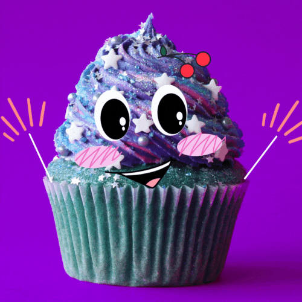

<p align="center">
  <a href="" rel="noopener">
 </a>
</p>

<h3 align="center">Alura Receita - Django</h3>

<div align="center">

[]()
[](https://github.com/kylelobo/The-Documentation-Compendium/issues)
[](https://github.com/kylelobo/The-Documentation-Compendium/pulls)
[](/LICENSE)

</div>

---

## 📝 Summary

- [About](#about)
- [Getting Started](#getting_started)
- [Built Using](#built_using)
- [Authors](#authors)
- [Acknowledgments](#acknowledgement)

## 🧐 About <a name = "about"></a>

Curso Introdutório a Pré intermediário de Django, da Alura, onde o objetivo é integrar o backend de um website de receitas, usando Python, Postgres e algumas ferramentas do Django admin para facilitar o gerenciamento

## 🏁 Getting Started <a name = "getting_started"></a>

Clone o repositório e siga as instruções de instalação

### Prerequisites

Python instalado;
PostgreSQL instalado;

### Installing

```
git clone https://github.com/ThiagoKS-7/Alura_Receita.git

pip install -r requirements.txt

python manage.py makemigrations

python manage.py migrate

python manage.py runserver
```

## ⛏️ Built Using <a name = "built_using"></a>

- [PostgreSQL](https://www.postgresql.org) - Database
- [Django](https://www.djangoproject.com) - Web Framework
- [Bootstrap](https://getbootstrap.com) - Layout

## ✍️ Authors <a name = "authors"></a>

- [@ThiagoKS-7](https://github.com/ThiagoKS-7) - Idea & Initial work

See also the list of [contributors](https://github.com/ThiagoKS-7/Alura_Receita/contributors) who participated in this project.

## 🎉 Acknowledgements <a name = "acknowledgement"></a>

- Hat tip to anyone whose code was used
- Inspiration
- References
